# Generating a tree using an L-system

This project is the final exercise and assignment I did for completing the university course
_Generative Design_ in the summer term of 2015. _Generative Design_ is [one of the electives in the _Computer Science and Media_ master degree program](https://mmi.beuth-hochschule.de/module/wp11/) at [Beuth University of Applied Sciences Berlin](https://www.beuth-hochschule.de/).
In the 2015 summer term the course _Generative Design_ [was taught by Max Goettner](https://github.com/generative-gestaltung/SS2015).


For the final assignment we were asked to meet the following general requirements:
* procedurally generating a virtual landscape, terrain, vegetation, organism, or the like
* providing the possibility of dynamically changing the scene (by user interaction or other forms of input)  

Since I wanted to learn more about fractals and L-systems, I decided to create a scene of generated plants or trees. We were allowed to use the programming language of our choice for the final project - I chose [Processing](https://processing.org/) (Version 2.2.1) as well as [OpenGL Shading Language (GLSL)](https://www.opengl.org/documentation/glsl/), since we were learning Processing and GLSL throughout the lectures and the preceding exercises.

There are a lot of 2D examples for generating structures that closely resemble trees or bushes using fractals or L-systems, such as Daniel Shiffman's Processing example [Recursive Tree](https://processing.org/examples/tree.html). In his book, [The Nature Of Code](http://natureofcode.com/book/chapter-8-fractals/), Daniel Shiffman dedicates an entire chapter to fractals and L-systems. I used his implementation of a 2D L-system as a starting point for generating a tree in 3D with Processing und OpenGL.  
<br/ >
Further references include  
+ Prusinkiewicz P. and Lindenmayer A. (1990). [_The Algorithmic Beauty Of Plants._](http://algorithmicbotany.org/papers/#abop). Springer, New York.
+ Ebert, Musgrave et al. (2003). _Texturing and Modeling. A Procedural Approach._ Morgan Kaufmann Publishers Inc., Third edition.
+ Deussen, O. (2003). _Computergenerierte Pflanzen. Technik und Design digitaler Pflanzenwelten._ Springer, Berlin.  

<br />
Screenshots of the resulting work are provided below as well as some short notes about concepts and components.
<br />
## Results
The example of a ternary tree structure described in the aforementioned book _"Texturing and Modeling. A Procedural Approach."_ (page 310) serves as the model of the production rule used in the present Processing sketch. The tree is generated in 5 iterations with the following L-system (see below for an explanation of how an L-system works):
```
F -> F[&F][^>F][^<F]
```
In order to generate a leafy tree, the production is expanded by an additional symbol:
```
F[&F*][^>F*][^<F*]
```
The initial branching angle is `23.5°`.

<br />
<div style="margin-left:5%">
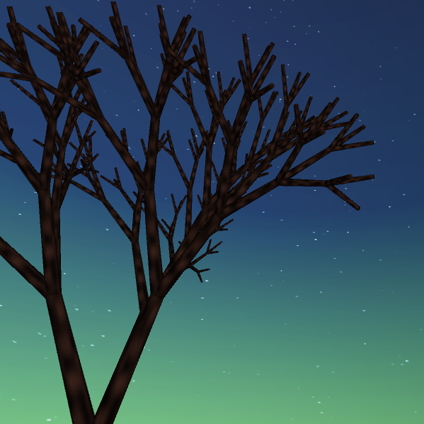
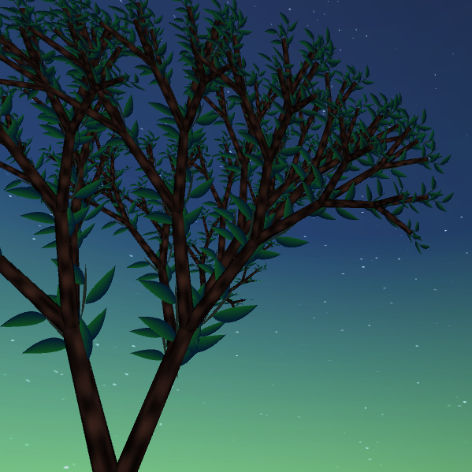
</div>

<div style="margin-left:5%">
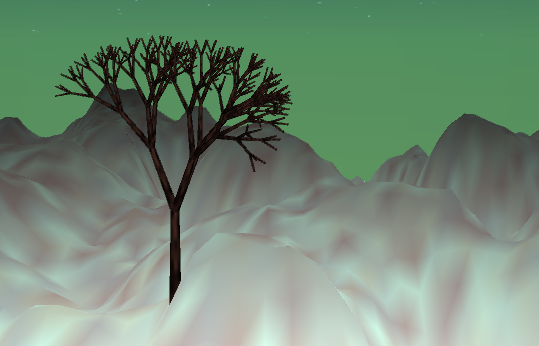
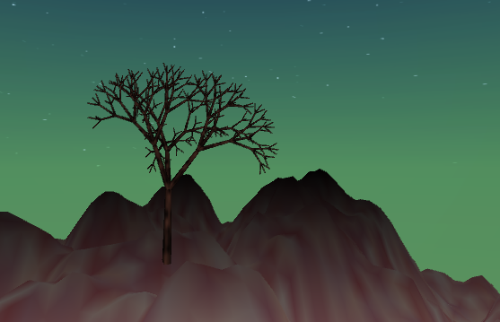
</div>

<br />
##### L-System
An L-system (aka _Lindenmayer-system_, named for Aristid Lindenmayer, a botanist and biologist) is a formal system defining a string-rewriting mechanism. An L-system consists of a starting sentence (composed of one or more characters), called the axiom. It also has a set of production rules which are instructions for rewriting the given axiom. These productions or rewriting rules are applied iteratively so that each generation recursively replaces characters according to the
ruleset. The result of such a procedure will be a different and most typically a much longer sentence. Therefore, L-systems can be used for modelling the growth of biological structures.

For example, given the axiom `b` and two productions `P1` and `P2`, with
`P1=a->ab` and `P2=b->a`.  
After 5 iterations we will get the following result:
```
     b
     a
     a b
   a b a
 a b a a b
```
In order to finally generate the geometry of a plant or a tree, the characters need to be interpreted graphically.  
<br />
The L-system I ended up with is composed of the following symbols and commands for graphical interpretation:  
```
F: Draw branch, move to its top
&: Pitch down by given angle
^: Pitch up by given angle
<: Roll left by given angle
>: Roll right by given angle
+: Turn left by given angle
-: Turn right by given angle
|: Turn around
[: Push current state to stack
]: Pop a state from stack
*: Draw leave at current position
```
<br />

##### Tree
A tree is composed of branches and leaves. By default, the tree is generated and rendered as a bare tree. The leaves can be toggled on/off using the `Control Panel` which is a user interface created
with the [controlP5 Library](http://www.sojamo.de/libraries/controlP5/).

A branch is represented by a cylindrical `PShape` object and it is drawn using `QUAD_STRIP`s. I followed the example from the [Processing shader tutorial](https://processing.org/tutorials/pshader/) to generate the geometry. A noise-generated texture is applied to give the shape the color pattern and look of a bark. The following images are examples of textures generated with the `noise()` function.
The left one (a combination of `noise()` and `sin()`) provides an interesting pattern which unfortunately loses its appeal when applied to the geometry - hence, the image on the right represents the kind of texture that is applied - note that each time the program starts, the texture is newly calculated. In the applied shader the texture is sampled and the final color and simple lighting (based on the [Processing shader tutorial](https://processing.org/tutorials/pshader/)) is calculated.
<br />

<div class="almost-centering">
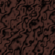
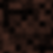
</div>

<br />

A leaf is also represented by a `PShape` object. For drawing the shape of a leaf the `bezierVertex()` function is used. No texture is applied to the leaves, instead, I do a simple color interpolation. The following picture shows a single leaf and also a group of leaves as used in the scene.
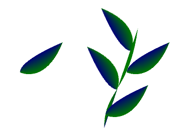

<br />
##### Terrain
Furthermore, the rendered scene includes a noise-generated terrain
(mainly following the examples and tutorials from the lecture), created as a `QUAD` mesh.
In the vertex shader the applied texture is used to calculate the terrain's height. In addition, a color interpolation is done based on the terrain's `y` - coordinate. The following image is a sample image of a terrain texture (again, each time the program starts the texture is newly calculated).
<br />

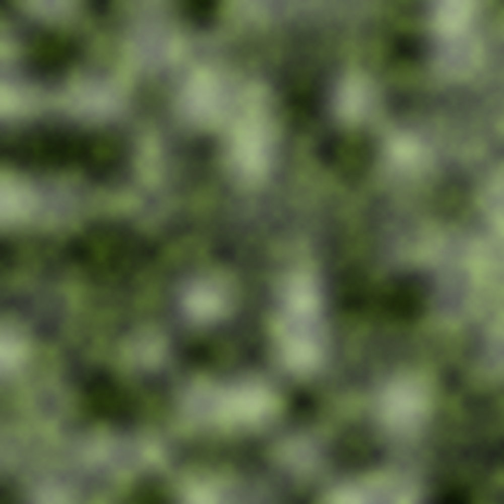

<br />

##### Sky
In order to give the scene a decent background I use a textured spherical `PShape` object, which is rendered with [disabled zbuffer](http://processing.github.io/processing-javadocs/core/) using the method `hint(DISABLE_DEPTH_TEST)` in order to imitate horizon and sky. The "skysphere" is then centered at the camera's position so that camera and scene are inside the sphere and the user will always look at the horizon of the scene. The sky is colored as a nighttime sky with small ellipses rendered to the texture representing stars. My intention to also include (animated) clouds in the final scene didn't work out because applied to the sphere the noise-generated clouds resulted in odd looking artefacts. However, to demonstrate one of the resulting textures, the following image shows an example with color interpolation, stars ellipsoidal stars and noise-generated clouds.

<br />

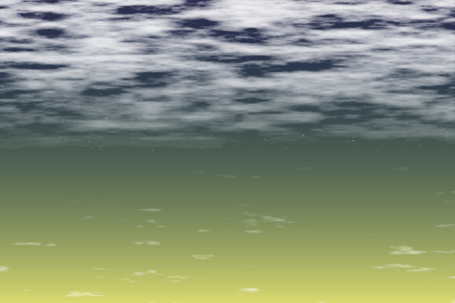

<br />  

##### Camera
The camera is implemented based on the examples and tutorials provided during the lectures. Main functionalities include modifying the camer's `y` - position and rotating the camera around the scene with the rotation radius and speed being adjustable via the control panel.  

<br />


##### Lighting
There is no complex lighting calculation in the scene. Most of the implemented lighting is based on the [Processing shader tutorial](https://processing.org/tutorials/pshader/).

<br />

##### Control Panel
The control panel is implemented using the [controlP5 Library](http://www.sojamo.de/libraries/controlP5/) and it allows the user to modify various settings of the objects in the scene and to arrange the scene to his or her liking.
For example, at program start it is most unlikely that the positions of the terrain and the tree match. Therefore, the user has to move the tree around in the scene to find a proper location. On the other hand, a more interesting structure can be applied to the terrain by tweaking its parameters, such as dimension, height, or color blending.

+ __tree specific settings:__
    * change position
    * increase/decrease branching angle
    * toggle leaves on/off (Note: rendering the leaves will slow the program down)
+ __terrain specific settings:__
    * vary terrain elevation
    * change dimensions
    * blend colors
+ __camera specific settings:__
    * height, rotation speed and radius


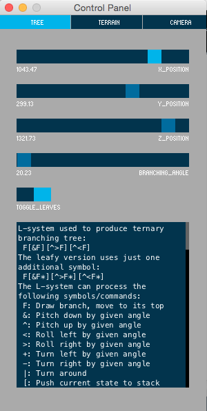
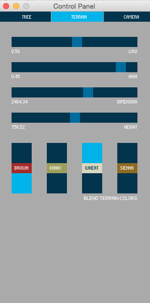
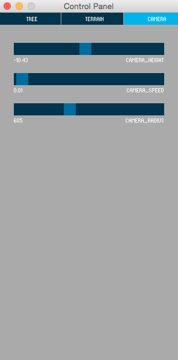


<br />
